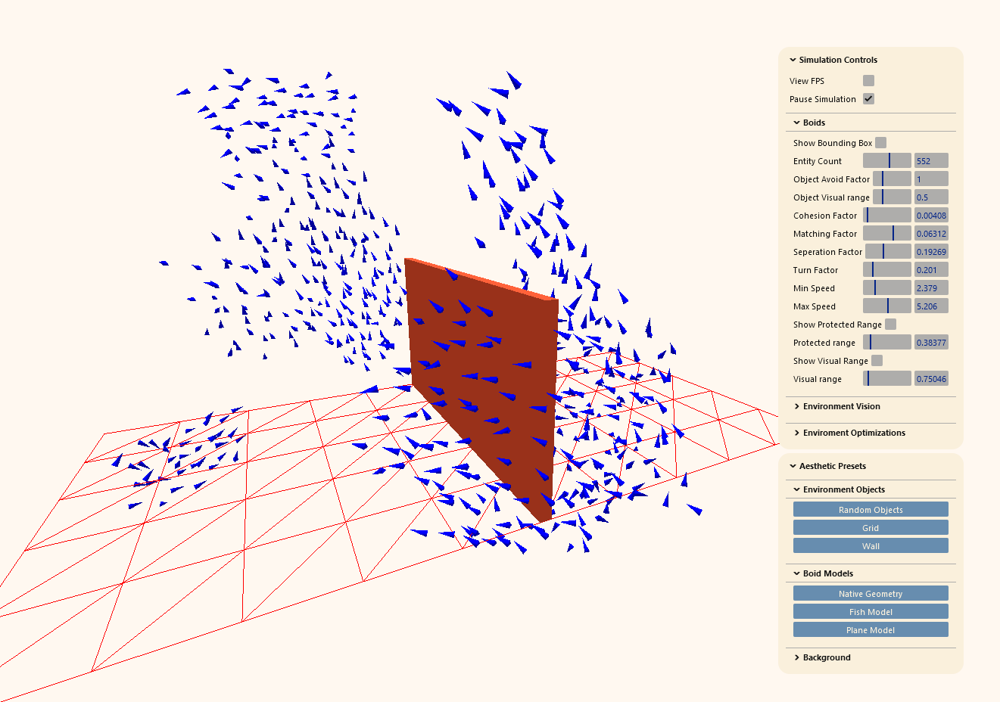

# 3D Boids Simulation Tool


## Description
three-boids-js is a JavaScript library designed to help developers easily create and customize boid simulations directly in the browser. Inspired by Craig Reynolds' "Boids" algorithm, this tool aims to provide a straightforward API to create, control, and visualize flocks of boids with minimal setup.

## Features
- **Easy Setup:** Quickly initialize boid simulations with a simple configuration.
- **Customizable Behavior:** Take controll over a variety parameters to tweak the boid behavior, update parameters in real time using the debug panel.
-  **Performance Optimized:** Efficiently handles large numbers of boids with smooth animations.
-  - _Instanced Meshes_ All boid meshes are dynamically instanced, resulting in only 1 draw call
-  - _Octree and BVH Optimized raycasting_ takes advantage of special datastructures to effectively nullify cost
- **Object Avoidance:** Easily add objects for boids to avoid. Uses Optimized raycasting algorithms with tweakable parameters

## Quick Start

Install three-boids npm package:
```js
npm i three-boids
```

then 

```js
import BOIDS from 'three-boids'
```

Create a standard three.js project, then 

```js
//create a boundning box and new boids instance
const box = new THREE.Box3(new THREE.Vector3(0,0,0),new THREE.Vector3(5,5,5)).setFromCenterAndSize()
const boids = new BOIDS(scene,box)

//initiate the boid simulation
boids.initBoids(200)

//add a mesh for the boids
const geometry=new THREE.ConeGeometry(0.2,0.9,3)
geometry.rotateX(-Math.PI * 0.5);
const mesh= new THREE.Mesh(testGeometry,new THREE.MeshBasicMaterial({color:"blue"}))
boids.setModelMesh(mesh,2)

//initiate the boids vision and add objects to avoid
boids.initVision()
const environmentObject= new THREE.Mesh(new THREE.BoxGeometry(1,1,1), new THREE.MeshBasicMaterial())
boids.addEnvironmentObjects([environmentObject],true)

//within your tick function, update the simulation
boids.update(elapsedTime,deltaTime)


```

## API Reference
| Method | Description | Default |
|----------|----------|----------|
### Initialisation
|<b> setParameters<b>({_parameters_})|Sets the start up boid parameters|
        `{visualRange:0.75046,
        protectedRange:0.38377,
        enviromentVision:0.5,
        objectAvoidFactor:1,
        cohesionFactor:0.00408,
        matchingFactor:0.06312,
        seperationFactor:0.19269,
        minSpeed:2.379,
        maxSpeed:5.206,
        turnFactor:0.201}`|

| <b> initBoids<b>(_count_) | Creates a new Boids instance, setting up the logic and setting the simulation running  | `200` |
| <b> initVision<b>() | Creates a new raycasting instance | |
### General
| <b> setModelMesh<b>(_model,scale,customMaterial_) | Create mesh for every boid and add to scene. Add a custom material if you want a different material to the supplied mesh |  |
| <b> changeModelMesh<b>(_model,scale,customMaterial_) | Changes the mesh for every boid. Add a custom material if you want a different material to the supplied mesh | |
| <b> addBoid<b>(_count_)|Adds _count_ amount of boids to the simulation||
|<b> removeBoid<b>(_count_)|Removes _count_ amount of boids to the simulation||
| <b> addEnvironmentObjects<b>(_enviromentObjects,reset_) | Adds new objects for boids to see | `reset = false` |
### Each Frame
| <b> update<b>(_elapsedTime,deltaTime_) | Updates the Simulation | |

### Debug
| <b> addDebug<b>(_gui_) | Adds debug panel to the scene | |
| <b> resetDebug<b>(_gui_) | Resets the debug panel | |


    

## Controls
### General Controls:
- **View FPS:** Toggles "Frames Per Second" display
- **Pause Simulation:** Pauses Simulation

### Boid Controls:
- **Show Bounding Box:** Toggles the confinment visualization
- **Entity Count:** The Amount of boids currently on screen
- **Object Avoid Factor:** The force at which boids avoid world objects
- **Object Visual Range:** The distance at which boids see world objects
- **Cohesion Factor:** Adjust how strongly boids are attracted to the center of the flock.
- **Alignment Factor:** Control how much boids try to match the velocity of neighbor boids within their _visual range_
- **Separation Factor:** The force at which boids avoid neighbor boids within their _protected range_
- **Matching Factor:** The force at which boids align velociy with neighbor boids within their _visual range_
- **Turn Factor:** The force at which boids turn around when out of bounds
- **Min Speed:** Set the minimum speed of boids.
- **Max Speed:** Set the maximum speed of boids.
- **Visual Range:** Adjust the range in which boids detect and react to nearby flockmates.
- **Protected Range:** Define the area in which boids are protected from external disturbances.

### Environment Vision Controls:
- **Show Rays:** Toggles display of ray targets. This represents the angle that the boid can see
- **Ray Count:** How many rays the boid casts per environment check
- **Ray Angle:** The angle at which the boid casts rays
- **Ray Distance:** The distance at which a collision is counted


## Future Goals
- Move the boid logic onto the gpu, using THREE.js/webGL GPGPU
- Add support for attraction/repulsion objects


## Performance 
This implementation of the boids algorithm runs on the cpu. As such it has a O(N<sup>2</sup>) time complexity. 
FPS does take a hit once you pass 500 entities. Onced moved onto the gpu, we should be able to handle orders of magnitude more


## References
- [Cornell University Lab](https://people.ece.cornell.edu/land/courses/ece4760/labs/s2021/Boids/Boids.html)
- [Original Paper by C.W.Reynolds](https://www.cs.toronto.edu/~dt/siggraph97-course/cwr87/)
- [distributing n points on a sphere](https://stackoverflow.com/questions/9600801/evenly-distributing-n-points-on-a-sphere)
- [Measurement of areas on a sphere using Fibonacci and latitude–longitude lattices](https://arxiv.org/pdf/0912.4540)
