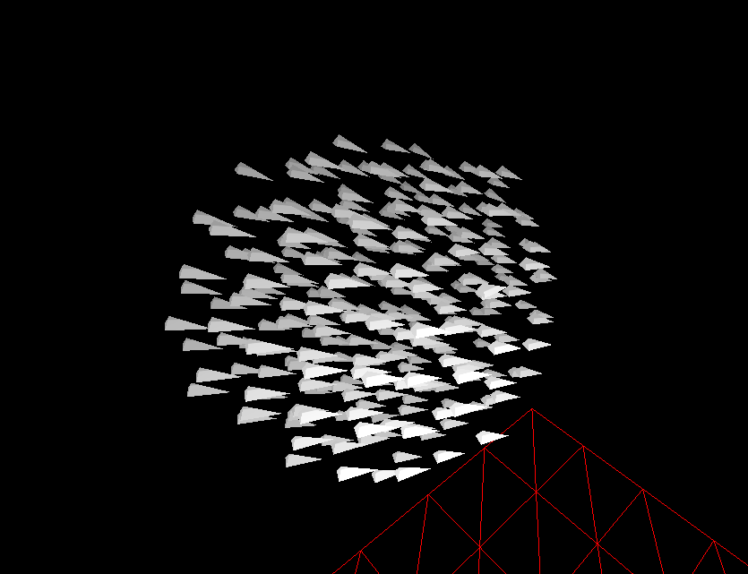
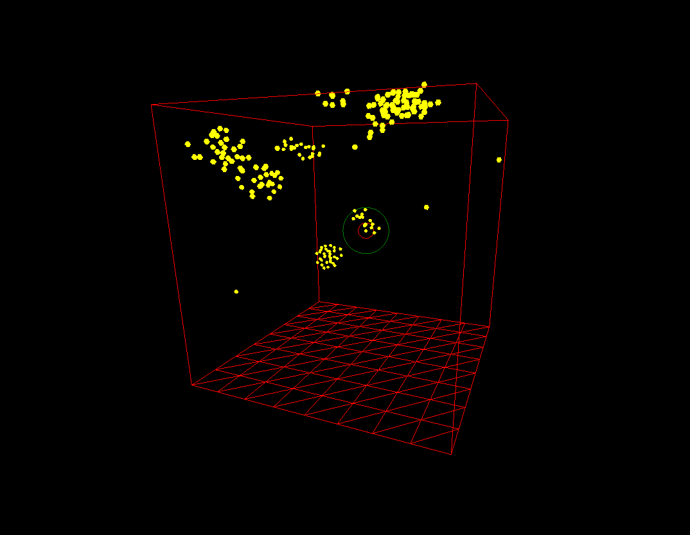
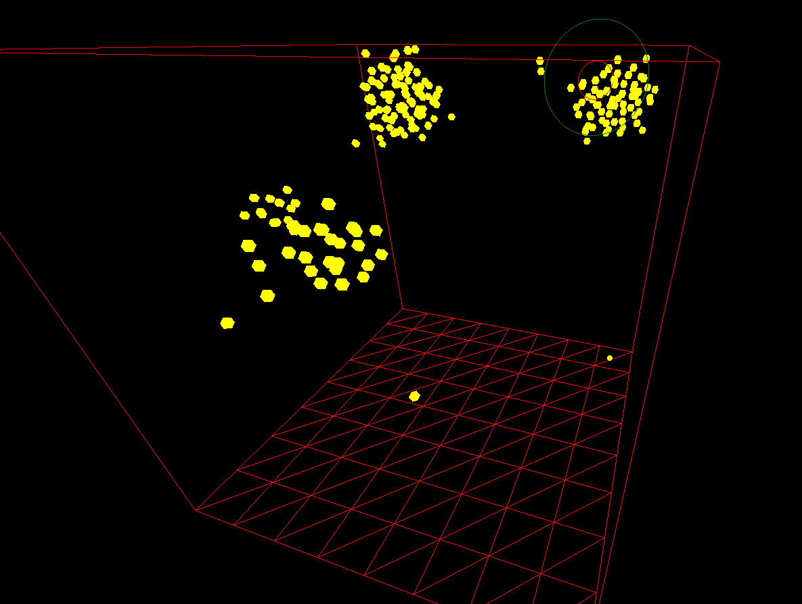
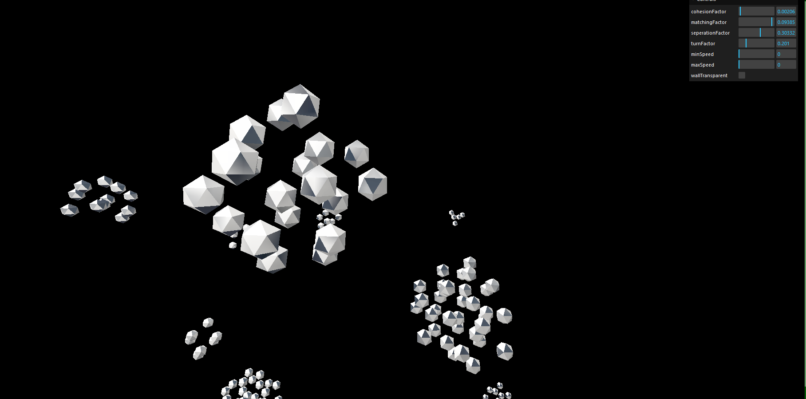
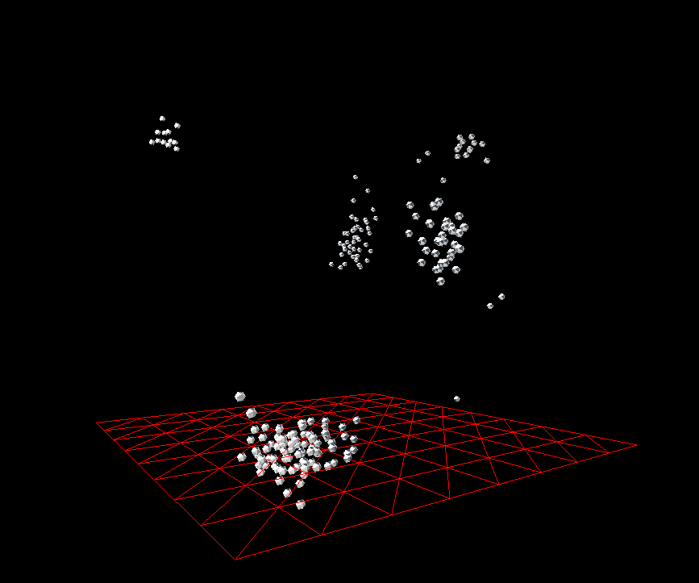

# 3D Boids Simulation with JavaScript, Three.js, and WebGL

## Description
three-boids-js is a JavaScript library designed to help developers easily create and customize boid simulations directly in the browser. Inspired by Craig Reynolds' "Boids" algorithm, this tool provides a straightforward API to create, control, and visualize flocks of boids with minimal setup.

## Features
- **Easy Setup:** Quickly initialize boid simulations with a simple configuration.
- **Customizable Behavior:** Take controll over a variety parameters to tweak the boid behavior, update parameters in real time using the debug panel.
-  **Performance Optimized:** Efficiently handles large numbers of boids with smooth animations.
-  - _Instanced Meshes_ All boid meshes are dynamically instanced, resulting in only 1 draw call
-  - _Octree and BVH Optimized raycasting_ Raycasting take advantage of special datastructures to effectively nullify cost
- **Object Avoidance:** Easily add objects for boids to avoid. Uses Optimized raycasting algorithms with tweakable parameters
- 

## Instructions
1. Clone or download the repository to your local machine.
2. Run `npm install` to install dependencies.
3. In the command line, run `npm run dev` to start the development server.
4. Interact with the simulation using the provided controls:
    - Adjust cohesion strength, alignment (matching) strength, separation distance, turn factor, min and max speed, visual range, and protected range to customize the behavior of the flock.

### Current Behavior
The boids are currently tweaked to mimic fish and other schooling animals.

    

## Controls
- **Cohesion Strength:** Adjust how strongly boids are attracted to the center of the flock.
- **Alignment Strength:** Control how much boids try to match the velocity of nearby flockmates.
- **Separation Distance:** Set the distance at which boids maintain separation from each other.
- **Turn Factor:** Determine how aggressively boids try to stay within view.
- **Min Speed:** Set the minimum speed of boids.
- **Max Speed:** Set the maximum speed of boids.
- **Visual Range:** Adjust the range in which boids detect and react to nearby flockmates.
- **Protected Range:** Define the area in which boids are protected from external disturbances.
- **Camera Views:** Toggle between different camera views to observe the flock's behavior from various perspectives.

## Resources
- [Cornell University Lab](https://people.ece.cornell.edu/land/courses/ece4760/labs/s2021/Boids/Boids.html)
- [Original Paper by C.W.Reynolds](https://www.cs.toronto.edu/~dt/siggraph97-course/cwr87/)
- [distributing n points on a sphere](https://stackoverflow.com/questions/9600801/evenly-distributing-n-points-on-a-sphere)
- [Measurement of areas on a sphere using Fibonacci and latitude–longitude lattices](https://arxiv.org/pdf/0912.4540)
- 

### Future Goals
- I aim to optimize this algorithim so that it runs on the gpu, using glsl 
- I aim to use rays to allow the boids to "see" their environement [DONE]
- i would like to add predetor/prey interactions

# Progression
This will be a little blog type inclusion. Read further if you want to see the progress of this project

### First Stages of converting to 3D

<!--  -->
### Working model with textures

### Better fish simulation

## Performance 
Performace is a big factor. There are two main things to update. 1. Our racasting 2. Our boids.
Before any performance optimizations, things broke down with 1500 boids(no raycasting), and 10 boids(with raycasting). EISH!
The boids would be easier to optimize, but the raycasting is our bottle neck. So lets tackle that first.

### Raycast Optimizations
Raycasting is expensive and we're firing 50+ per boid. 
THREE.js's implementation of raycasting loops over every face of the supplied geometries. 
 
To measure performace I created a simple function to time execution.
constants:
- 400 rays per boid. 
- 360 deg angle 

#### Base Case
| Boid Count | Avg Execution Time Per Boid|
|-----------------|-----------------|
| 1 | 286ms |
| 5 | 323.8ms |
| 10 | 322ms |
| 50 | 329ms |
| 100 | 329ms |
| 200 | 324ms |

Linear time complexity. Average Excution per boid stays around 324ms

#### Fixes

| Fixes | Boid Count| Avg Execution Time Per Boid|
|-----------------|-----------------|-----------------|
| 1 | 200 |62.9ms |
| 2 | 200 |0.56ms |
| 3 | 200 |0.084ms |
| 4 | 200 |0.058ms |

#### Fix 1: 
simply added .computeBoundingBox() to environment objects

| Boid Count | Avg Execution Time Per Boid|
|-----------------|-----------------|
| 200 | 62.9ms |

5x performace increase. 

#### Fix 2: 
Implemented a BVH from three-bvh

| Boid Count | Avg Execution Time Per Boid|
|-----------------|-----------------|
| 200 | 0.56ms |

112.32x performace increase. 

#### Fix 3: 
Implemented a Octree spacial lookup for the environment objects

| Boid Count | Avg Execution Time Per Boid|
|-----------------|-----------------|
| 200 | 0.084ms |

6.67x performace increase. 

#### Fix 4: 
Moved the octree check before raycaster is setup. this way, if the octree check returns null, 
positioning of targets and raycasting will be completely skipped

| Boid Count | Avg Execution Time Per Boid|
|-----------------|-----------------|
| 200 | 0.058ms |

1.448x performace increase. 

<!-- #### Fix 5: 
Now we have optimized the actual raycasting execution as far as we can, lets look at the whole class.
Implementing a staggered update, i.e only tests specific boids on each tick, not the entire list

Worst Case conditions. Each boid has to test its surroundings

| sta| Avg Execution Time Per Boid| Avg Execution Time Per Boid|
|-----------------|-----------------|-----------------|
| 200 | 0.058ms | 0.058ms | -->

1.448x performace increase. 